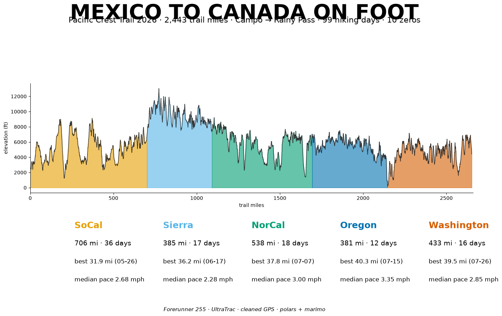

# PCT 2026 — Hike Data Analysis



This project was substantially produced with the help of AI coding tools.

A data scientist's thru-hike, quantified: 109 days on the Pacific Crest
Trail with a Garmin Forerunner 255 recording every hiking day. GPS cleanup,
trail analysis, and visualizations below — narrative in
[`notebooks/report.py`](notebooks/report.py), methods in
[`docs/methodology.md`](docs/methodology.md).

## Overall

| Trail miles | Hiking days | Biggest day | Ascent | Descent | Avg/day | Route |
|---|---|---|---|---|---|---|
| 2,442.8 | 99 (+10 zeros) | 40.3 mi (Jul 15) | 427,500 ft | 430,400 ft | 24.7 mi | Campo → Rainy Pass* |

*\*Final ~61 mi closed by the Ptarmigan fire.*

## By section

| Section | Miles | Days | Avg/day | Full (≥20) | Neros (<20) | Median pace |
|---|---|---|---|---|---|---|
| SoCal (0–702) | 706.3 | 36 | 19.6 | 21 | 15 | 2.68 mph |
| Sierra (702–1092) | 384.8 | 17 | 22.6 | 11 | 6 | 2.28 mph |
| NorCal (1092–1694) | 537.5 | 18 | 29.9 | 17 | 1 | 3.00 mph |
| Oregon (1694–2146) | 380.7 | 12 | 31.7 | 12 | 0 | 3.35 mph |
| Washington (2146–end) | 433.5 | 16 | 27.1 | 12 | 4 | 2.86 mph |

## Quickstart

```bash
uv sync
uv run marimo edit notebooks/report.py   # the story
uv run marimo edit notebooks/pct.py      # the working notebook
```

Full pipeline commands are in [`docs/methodology.md`](docs/methodology.md).
`rawdata/`, `data/`, `annotations/` and `graphics/` are local-only and
gitignored. Built with Python, polars, marimo, altair, plotly — pair-built
with Muse Spark (via OpenCode).
